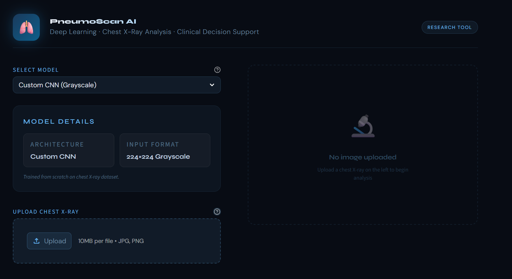
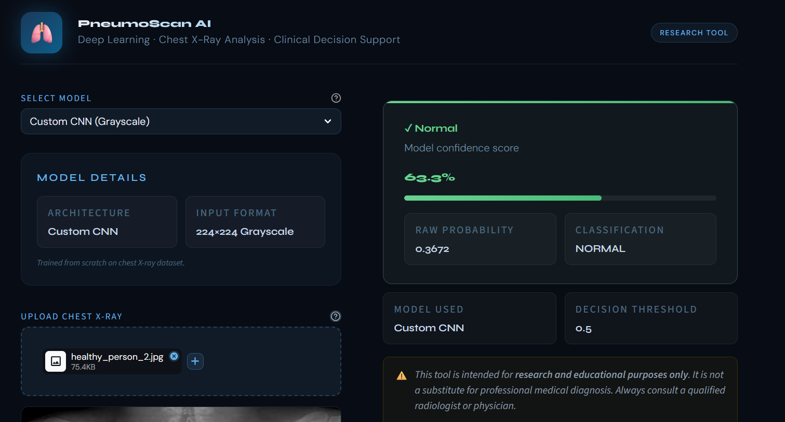
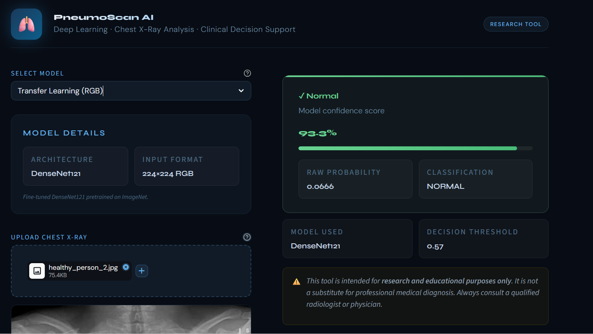

# PneumoScan AI — Pneumonia Detection from Chest X-Rays

[](https://huggingface.co/spaces/Tejas-ML/pneumonia-detection-app)
[](https://www.python.org/)
[](https://www.tensorflow.org/)
[](https://streamlit.io/)
[](https://www.kaggle.com/)

A deep learning project that detects **Pneumonia from pediatric chest X-ray images** using two independently developed convolutional neural network models — a **Custom CNN built from scratch** and a **DenseNet121 Transfer Learning model** — both deployed in a production-quality Streamlit web application named **LungLens AI**.

> **Live Demo** → [huggingface.co/spaces/Tejas-ML/pneumonia-detection-app](https://huggingface.co/spaces/Tejas-ML/pneumonia-detection-app)

---

## Table of Contents

- [Project Overview](#project-overview)
- [Repository Structure](#repository-structure)
- [Dataset](#dataset)
- [Model 1 — Custom CNN](#model-1--custom-cnn-built-from-scratch)
- [Model 2 — Transfer Learning DenseNet121](#model-2--transfer-learning-densenet121)
- [Model Comparison](#model-comparison)
- [PneumoScan AI — Streamlit App](#pneumoscan-ai--streamlit-app)
- [App Screenshots](#app-screenshots)
- [Requirements](#requirements)
- [Deployment](#deployment)
- [Author](#author)
- [Acknowledgements](#acknowledgements)

---

## Project Overview

Pneumonia is a life-threatening lung infection, particularly dangerous in pediatric patients. Radiologists diagnose it by identifying cloudy opacities and infiltrates within the lung cavities on chest X-rays — subtle visual patterns that a well-trained convolutional neural network can learn to detect automatically.

This project explores and compares two distinct deep learning strategies for binary classification of chest X-rays into two categories:

| Label | Description |
|-------|-------------|
| `NORMAL` | Healthy lungs — dark, clear X-ray with no visible infiltrates |
| `PNEUMONIA` | Infected lungs — cloudy white opacities visible in lung cavities |

**Clinical Design Philosophy**

In medical AI, raw accuracy is not a sufficient metric. The dataset is imbalanced (approximately 3:1 Pneumonia to Normal), and the cost of errors is asymmetric:

- A **False Negative** (model predicts Normal when patient has Pneumonia) can be fatal — a sick patient is sent home untreated.
- A **False Positive** (model predicts Pneumonia when patient is healthy) only triggers a follow-up test — an inconvenience, not a danger.

Both models are therefore designed and evaluated with a primary focus on **Recall (Sensitivity)** and **F1-Score** rather than accuracy alone.

---

## Repository Structure

```
pneumonia-detection/
│
├── notebooks/
│   ├── custom_cnn.ipynb                      # Custom CNN — EDA, architecture, training, evaluation, inference
│   └── transfer_learning_densenet.ipynb      # DenseNet121 — two-phase training, threshold optimization
│
├── app/
│   └── app.py                                # PneumoScan AI — Streamlit deployment application
│
├── images/
│   ├── samples/                              # Sample Normal and Pneumonia X-ray images
│   └── results/                              # App screenshots from Hugging Face deployment
│
├── requirements.txt
└── README.md

```

> Model weight files (`.keras`) are not included in this repository due to size. They are hosted on and served from Hugging Face Hub — see [Deployment](#deployment).

---

## Dataset

**Chest X-Ray Images (Pneumonia)** — [Kaggle, Paul Mooney](https://www.kaggle.com/datasets/paultimothymooney/chest-xray-pneumonia)

| Split | Total | Normal | Pneumonia |
|-------|-------|--------|-----------|
| Train | 5,216 | 1,341 | 3,875 |
| Validation | 16 | 8 | 8 |
| Test | 624 | 234 | 390 |

**Class Imbalance**

The training set contains approximately **3x more Pneumonia samples than Normal** (3,875 vs 1,341). This imbalance reflects real-world clinical distributions but must be explicitly addressed during training. Each model in this project handles the imbalance using a different strategy — details are provided in the respective model sections.

---

## Model 1 — Custom CNN (Built from Scratch)

A Sequential Convolutional Neural Network trained entirely from random weight initialization on grayscale chest X-rays. This model serves as a strong baseline and demonstrates that a well-designed architecture trained from scratch can achieve clinical-grade performance without relying on pretrained weights.

### Preprocessing Decision — Grayscale Input

Chest X-rays carry no meaningful color information. Loading images in grayscale (`color_mode='grayscale'`) reduces the input tensor from 3 channels to 1, which lowers memory consumption, reduces the number of parameters in the first convolutional layer, and speeds up training — without any loss of diagnostic information.

### Architecture

```
Input: (224 × 224 × 1)
│
├── Rescaling(1/255)                          # Normalize pixel values to [0, 1]
│
├── RandomFlip("horizontal")                  # Data augmentation — applied during training only
├── RandomRotation(factor=0.1)
├── RandomZoom(factor=0.1)
│
├── Conv2D(32, 3×3, relu, padding=same)       # Block 1 — detects edges, rib curvature
├── MaxPooling2D(2×2)                         # Output: (112 × 112 × 32)
│
├── Conv2D(64, 3×3, relu, padding=same)       # Block 2 — learns basic lung structures
├── MaxPooling2D(2×2)                         # Output: (56 × 56 × 64)
│
├── Conv2D(128, 3×3, relu, padding=same)      # Block 3 — captures complex textures
├── MaxPooling2D(2×2)                         # Output: (28 × 28 × 128)
│
├── Conv2D(128, 3×3, relu, padding=same)      # Block 4 — high-level opacity patterns
├── MaxPooling2D(2×2)                         # Output: (14 × 14 × 128)
│
├── Flatten()                                 # Output: (25,088)
├── Dense(512, relu)
├── Dropout(0.5)                              # Aggressive regularization — prevents overfitting
│
└── Dense(1, sigmoid)                         # Binary output: P(Pneumonia)
```

**Total Parameters: 13,086,337 (~49.92 MB)**

### Training Configuration

| Setting | Value |
|---------|-------|
| Optimizer | Adam (`lr=1e-4`, `clipnorm=1.0`) |
| Loss | Binary Crossentropy |
| Batch size | 64 (32 per GPU × 2 GPUs) |
| GPU strategy | `tf.distribute.MirroredStrategy` — dual NVIDIA T4 |
| Max epochs | 25 |
| Actual epochs | 11 (early stopping triggered) |
| Imbalance handling | In-model augmentation (flip, rotation, zoom) |

**Callbacks**

- `EarlyStopping(monitor='val_loss', patience=5, restore_best_weights=True)` — halts training when validation loss stops improving and restores the best checkpoint.
- `ReduceLROnPlateau(monitor='val_loss', factor=0.3, patience=3, min_lr=1e-6)` — reduces the learning rate when the model plateaus, allowing finer gradient updates near the optimum.

### Test Set Results (624 images)

| Metric | Normal | Pneumonia |
|--------|--------|-----------|
| Precision | 0.84 | 0.94 |
| Recall | 0.91 | 0.89 |
| F1-Score | 0.87 | 0.92 |
| **Overall Accuracy** | | **90.06%** |

---

## Model 2 — Transfer Learning (DenseNet121)

A fine-tuned **DenseNet121** architecture pretrained on ImageNet, adapted for chest X-ray classification using the Keras Functional API. Transfer learning leverages feature representations already learned from 1.4 million images, allowing the model to converge faster and generalize better with limited medical data.

### Preprocessing Decision — RGB Input

Although chest X-rays are naturally grayscale, DenseNet121 was pretrained on ImageNet which uses 3-channel RGB images. Loading X-rays in `color_mode='rgb'` satisfies the backbone's expected input tensor shape `(224, 224, 3)` without requiring any architectural modifications to the pretrained base.

### Architecture

```
Input: (224 × 224 × 3)
│
├── Rescaling(1/255)
├── RandomFlip("horizontal")
├── RandomRotation(factor=0.1)
├── RandomZoom(factor=0.1)
│
├── DenseNet121(weights='imagenet', include_top=False)   # Pretrained backbone
│     └── Output: (7 × 7 × 1024)
│
├── GlobalAveragePooling2D()                             # Replaces Flatten — reduces overfitting
├── BatchNormalization()                                 # Stabilizes training of custom head
├── Dense(256, relu)
├── Dropout(0.4)
│
└── Dense(1, sigmoid)                                    # Binary output: P(Pneumonia)
```

| Parameter Group | Count |
|----------------|-------|
| Total parameters | 7,304,257 |
| Trainable (Phase 1 — head only) | 264,705 |
| Non-trainable (frozen backbone) | 7,039,552 |

### Class Imbalance Handling

Unlike the Custom CNN which uses augmentation, the DenseNet model addresses imbalance via **computed class weights** applied during `model.fit()`:

```python
class_weight = {
    0: 1.9448   # NORMAL    — minority class, penalized more heavily
    1: 0.6730   # PNEUMONIA — majority class, penalized less
}
```

This forces the optimizer to pay proportionally more attention to misclassifying Normal cases during backpropagation.

### Two-Phase Training Strategy

**Phase 1 — Custom Head Training (Frozen Backbone)**

The DenseNet121 backbone is fully frozen. Only the 264,705 parameters of the custom classification head are trained. This prevents the pretrained ImageNet weights from being corrupted during the initial high-loss epochs.

| Setting | Value |
|---------|-------|
| Backbone | Frozen (`trainable=False`) |
| Learning rate | `1e-3` |
| Monitor metric | `val_auc` (more stable than `val_loss` for imbalanced data) |
| Epochs run | 6 (early stopping triggered) |

**Phase 2 — Fine-Tuning (Partial Unfreeze)**

The last 50 layers of DenseNet121 are unfrozen while all earlier layers remain frozen. A significantly lower learning rate is used to make small, careful adjustments to the pretrained weights without destroying the learned ImageNet representations.

| Setting | Value |
|---------|-------|
| Unfrozen layers | Last 50 of DenseNet121 |
| Learning rate | `1e-5` (100x lower than Phase 1) |
| Monitor metric | `val_auc` |
| Epochs run | 9 (early stopping triggered, best weights from epoch 4 restored) |

Both phases use `clipnorm=1.0` for gradient clipping and `ModelCheckpoint` to save the best weights.

### Threshold Optimization

The default sigmoid threshold of 0.5 is not always optimal, especially for imbalanced medical datasets. A threshold sweep from 0.20 to 0.80 was performed on the test set to find the value that maximizes **Macro F1-Score** — the harmonic mean of F1 across both classes.

| Threshold | Normal Recall | Pneumonia Recall | Macro F1 |
|-----------|--------------|------------------|----------|
| 0.30 | 0.7350 | 0.9487 | 0.8539 |
| 0.40 | 0.7991 | 0.9282 | 0.8695 |
| 0.50 | 0.8333 | 0.9154 | 0.8763 |
| 0.55 | 0.8590 | 0.9077 | 0.8824 |
| **0.57** | **0.8718** | **0.9128** | **0.8877** |

The optimal threshold of **0.57** was selected and applied in the deployed application.

### Test Set Results (624 images, threshold = 0.57)

| Metric | Normal | Pneumonia |
|--------|--------|-----------|
| Precision | 0.85 | 0.92 |
| Recall | 0.87 | 0.91 |
| F1-Score | 0.86 | 0.91 |
| **Overall Accuracy** | | **89%** |

---

## Model Comparison

| Attribute | Custom CNN | DenseNet121 (TL) |
|-----------|-----------|-----------------|
| Input format | Grayscale (1 channel) | RGB (3 channels) |
| Total parameters | 13,086,337 | 7,304,257 |
| Training approach | From scratch | Two-phase fine-tuning |
| Imbalance strategy | Data augmentation | Computed class weights |
| Decision threshold | 0.50 (default) | 0.57 (optimized) |
| Overall accuracy | **90.06%** | 89.00% |
| Pneumonia Recall | 89.49% | **91.28%** |
| Pneumonia Precision | **0.94** | 0.92 |
| Pneumonia F1 | **0.92** | 0.91 |
| Normal F1 | **0.87** | 0.86 |

**Summary**: The Custom CNN achieves higher overall accuracy, Pneumonia Precision, and Normal F1. The DenseNet121 model edges ahead on Pneumonia Recall — meaning it misses fewer true Pneumonia cases, which is the most critical metric in a clinical screening context. The choice between models depends on whether the deployment priority is minimizing false positives or false negatives.

---

## PneumoScan AI — Streamlit App

The deployed web application allows users to upload a chest X-ray image and receive an instant AI-assisted diagnosis with a confidence score. The interface is designed to be clean, informative, and responsible in how it presents model outputs to non-technical users.

### Application Features

**Model Selection**
Users can switch between the Custom CNN and DenseNet121 at runtime. The app automatically handles the preprocessing difference — grayscale conversion for the CNN and RGB for DenseNet — without any manual input from the user.

**Prediction Output**
- Raw sigmoid probability from the model
- Binary diagnosis: `NORMAL` or `PNEUMONIA DETECTED`
- Visual confidence bar scaled to the model's certainty
- Decision threshold displayed alongside the result (`0.50` for CNN, `0.57` for DenseNet)

**Clinical Precaution Panel**
When Pneumonia is detected, the app renders a structured panel of 6 medical precautions: seek immediate medical attention, complete bed rest, hydration, infection control and isolation, respiratory monitoring, and avoidance of lung irritants.

**Medical Disclaimer**
Every prediction is accompanied by a prominent disclaimer stating that PneumoScan AI is a research and educational tool only and must not be used as a substitute for professional radiological diagnosis.

### Run Locally

```bash
git clone https://github.com/TejasML/Pneumonia-Detection.git
cd pneumonia-detection
pip install -r requirements.txt
streamlit run app/app.py
```

> **Note**: The app downloads model weights from Hugging Face Hub at runtime via `hf_hub_download`. An active internet connection is required. If the models are in a private repository, you will also need to set your Hugging Face token:
> ```bash
> huggingface-cli login
> ```

---

## App Screenshots

**Home Screen**



**Normal Prediction**



**Pneumonia Detected**



## Requirements

```
tensorflow>=2.12
streamlit
numpy
matplotlib
seaborn
scikit-learn
Pillow
huggingface_hub
```

```bash
pip install -r requirements.txt
```

---

## Deployment

Model weight files are excluded from this repository due to size constraints. They are stored on and served from Hugging Face Hub:

- **Model repository**: `Tejas-ML/pneumonia-detection-models`
- **Deployed application**: [huggingface.co/spaces/Tejas-ML/pneumonia-detection-app](https://huggingface.co/spaces/Tejas-ML/pneumonia-detection-app)

---

## Author

**Tejas** — [Hugging Face](https://huggingface.co/Tejas-ML) · [Kaggle Notebook](https://www.kaggle.com/code/tejas5112/pnuemonia-detection)

---

## License

This project is licensed under the MIT License.

---

## Acknowledgements

- [Chest X-Ray Images (Pneumonia)](https://www.kaggle.com/datasets/paultimothymooney/chest-xray-pneumonia) — Paul Mooney, Kaggle
- [Densely Connected Convolutional Networks](https://arxiv.org/abs/1608.06993) — Huang et al., 2017
- Kaggle for dual NVIDIA T4 GPU compute environment
- Hugging Face for free model hosting and Spaces deployment infrastructure
